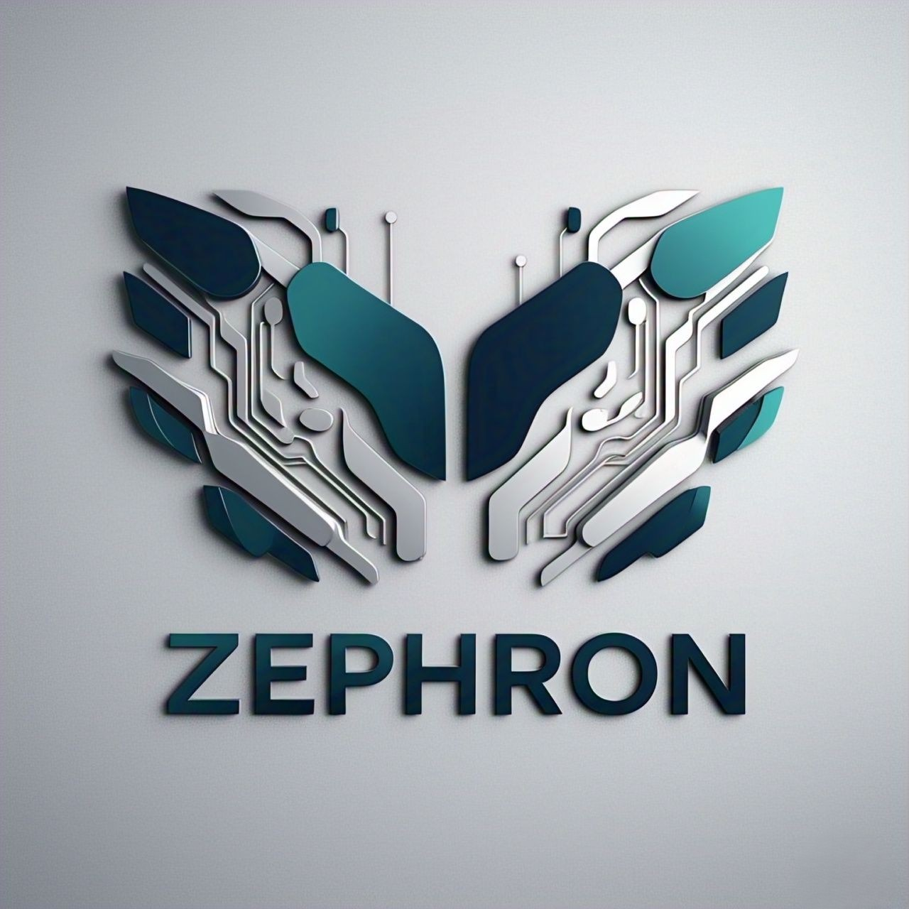

<p align="center">
	
</p>

<p align="center">
	
	
	
	
	
</p>

# Zephron

Zephron is a browser-based voice assistant dashboard with a local Python server, task tracking, note capture, quick prompts, and optional voice interaction.

## Overview

Zephron runs locally, keeps state in the browser, and exposes a focused control surface for everyday assistant-style actions without a backend dependency.

## Features

- Chat-style assistant interface
- Always-listen mode for continuous voice control when supported
- Voice reply toggle for spoken responses
- Task management for adding, completing, and removing items
- Notes for quick capture and cleanup
- Reminder workflow with desktop alerts when the browser supports notifications
- Calendar export and email sharing for reminders
- Quick prompts for common actions
- Browser local storage for persistence between sessions

## Quick Start

```bash
python main.py
```

By default, Zephron serves the `frontend` folder on `http://127.0.0.1:8000/` and opens a browser automatically.

Optional flags:

```bash
python main.py --port 8080
python main.py --no-browser
```

## Requirements

- Python 3.9 or newer
- A modern browser with support for the Web Speech APIs for voice input and speech output
- Notification support for desktop reminder alerts

## Browser Support

Zephron works best in Chromium-based browsers that support speech recognition and speech synthesis.

If a browser feature is unavailable, the UI disables unsupported controls instead of failing.

## Project Structure

```text
main.py               # Local Python server
frontend/index.html   # App shell
frontend/style.css    # Visual design
frontend/script.js    # Assistant behavior
logo.jpg              # Project logo used in the README
```

## License

This project is licensed under the MIT License. See [LICENSE](LICENSE).